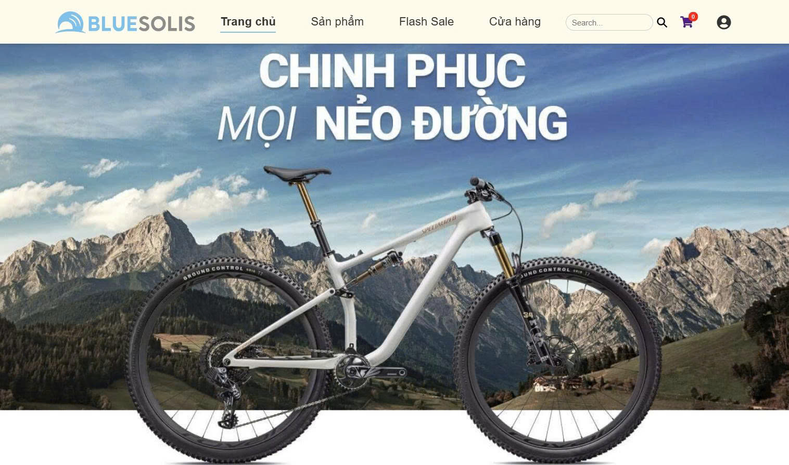
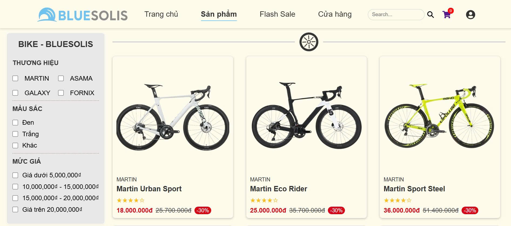
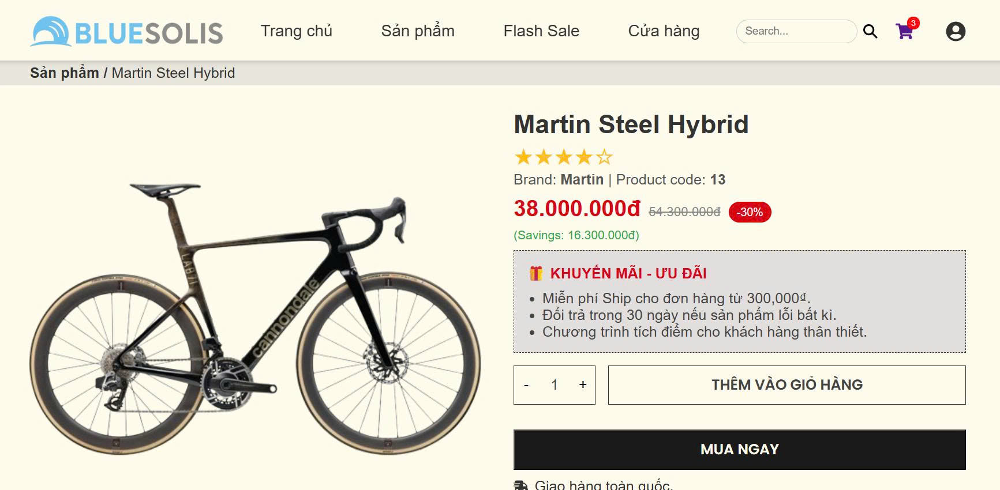
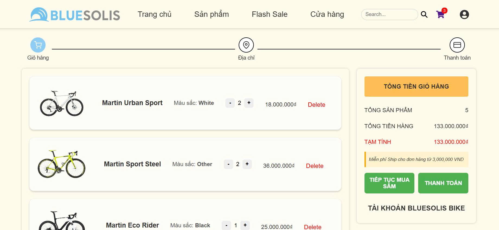
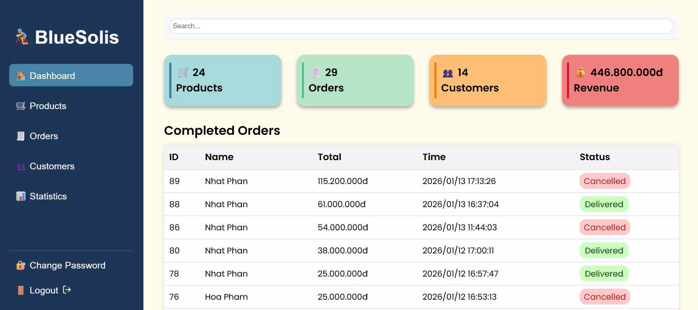

# Bicycle E-commerce Website

A modern full-stack bicycle store web application that allows users to browse products, manage a shopping cart, authenticate accounts, complete checkout, and manage products through an admin dashboard.
Built with React, Node.js, Express, and MySQL.

## Live Demo

Frontend: []

Backend API: []

## Features

- User authentication (register & login)
- Browse bicycle products
- Product detail page
- Add items to cart
- Order checkout
- Admin dashboard to manage products
- Responsive design for mobile and desktop

## Screenshots

Home Page  

Product Page  

Product Detail Page  

Cart Page  

Dashboard Page

---

## Tech Stack

### Frontend

- React
- SCSS(BEM)
- Axios

### Backend

- Node.js
- Express.js

### Database

- MySQL

### Tools

- Git
- Postman
- Figma

---

## Installation

Clone the repository: https://github.com/NhatPhan2004/bike-ecommerce.git

---

## Running the Project

### Start backend server

cd server

node server.js

### Start frontend

cd client

npm start

---

## API Endpoints

GET /api/products  
GET /api/products/:id  
POST /api/auth/login  
POST /api/orders

---

## What I Learned

This project helped me practice:

- Building REST APIs with Node.js and Express
- Managing frontend state in React
- Implementing authentication
- Designing responsive UI
- Structuring a full-stack application

---

## Author

Name: PHAN NHU NHAT

GitHub: https://github.com/NhatPhan2004
